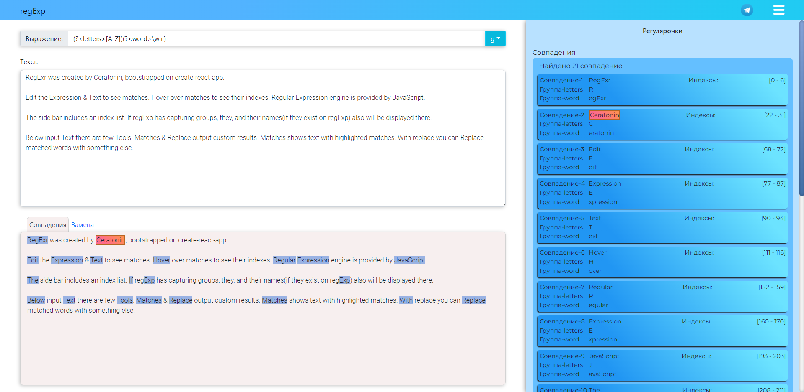

# Приложение RegEx
## Описание:
Сайт разработан для облегчения работы с регулярными выражениями. Пользователь вводит регулярное выражение и текст, в котором он хочет по этому регулярному выражению найти совпадения
Приложение основано на create-react-app
__________

__________
## Структура сайта:
* Поле ввода регулярного выражения 
* Поле ввода текста, для которого будет сопоставлено регулярное выражение
* Блок совпадения, в котором отображается введенный пользователем текст с подсвеченными совпадениями
* Блок замены. Пользователь вводит в строку ввода, значение, которым надо заменить совпадение, в блоке внизу выдается результат
* Сайдбар, в котором отображаются индексы значений и совпадения по скобочным группам захвата

__________
## Запуск приложения:  
`npm start`